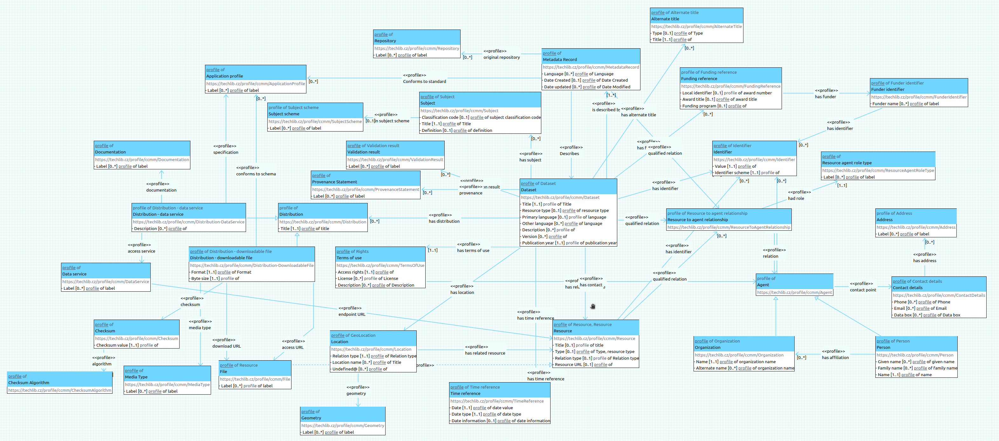

# Czech Core Metadata Model specification

This repository contains specification of Czech Core Metadata Model modelled in and generated from DataSpecer.
Changes are described in [RELEASE_NOTES](RELEASE_NOTES.md).
DataSpecer generates schema diagram in bad resolution, therefore we generated diagram image in better quality.

The structure of the repository is as follows. For the documenattion and publication purposes were created GitHub pages. In each section, there is a link to the published specifications.

## cs

Directory /cs contains Czech version of CCMM Application Profile specification. Specification is available on https://eosc-cz.github.io/CCMM/cs/.

## en

Directory /en contains English version of CCMM Application Profile specification. Specification is available on https://eosc-cz.github.io/CCMM/en/.

## Resources

Directory resources/ contains data specification in json format. It also contained file with the full content of the Dataspecer project, which is too large for GitHub repository, therefore it is not part of the directory.

## Czech core metadata model

Root directory contains also all structured artifacts generated from Dataspecer. There are many subdirectories, one per each element of the data structures. 

Each subdirectory contains strucutured models formalized in XSD (schema.xsd). Root element for the whole profile is **Dataset**

|Root element|XSD schema|
| - | - | 
|Dataset|https://eosc-cz.github.io/CCMM/dataset/schema.xsd|

On the directory level, there is also [documentation](https://eosc-cz.github.io/CCMM/czech-core-metadata-model/en) of data structures. 

[Project to open in DataSpecer](https://github.com/EOSC-CZ/CCMM/blob/main/Czech%20Core%20Metadata%20Model-Backup.zip) is also part of the repository. You may import it into your instance of Dataspecer.

